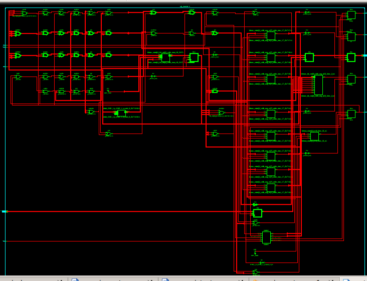
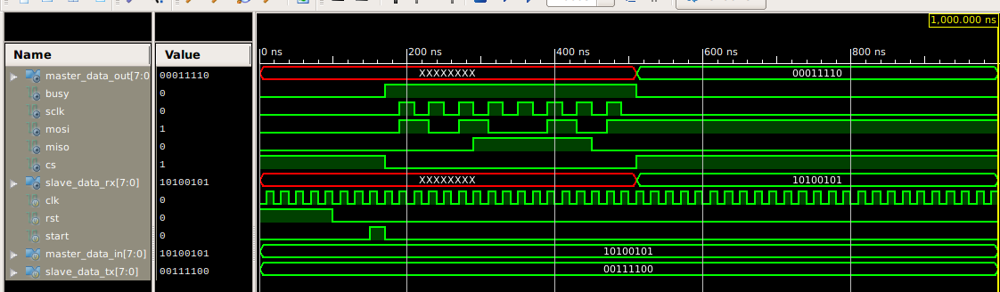
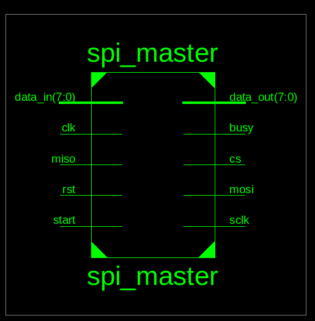

# 🚀 SPI Protocol Implementation in Verilog

[](https://opensource.org/licenses/MIT)
[](https://en.wikipedia.org/wiki/Verilog)
[](https://www.xilinx.com/)

A complete implementation of the SPI (Serial Peripheral Interface) communication protocol in Verilog HDL, featuring both master and slave modules with comprehensive testbench verification.

## 📋 Table of Contents

- [Overview](#-overview)
- [Features](#-features)
- [SPI Protocol Basics](#-spi-protocol-basics)
- [Architecture](#-architecture)
- [Module Specifications](#-module-specifications)
- [Synthesis Results](#-synthesis-results)
- [Simulation](#-simulation)
- [Getting Started](#-getting-started)
- [File Structure](#-file-structure)
- [Contributing](#-contributing)

## 🎯 Overview

This project implements a full-duplex SPI communication system with:
- **SPI Master**: Initiates communication, generates clock, and controls chip select
- **SPI Slave**: Responds to master commands and exchanges data
- **Comprehensive Testbench**: Validates the communication protocol

The implementation supports SPI Mode 0 (CPOL=0, CPHA=0) and has been successfully synthesized and tested on FPGA platforms.

## ✨ Features

- 🔄 **Full-duplex communication** - Simultaneous transmit and receive
- ⚡ **Configurable clock speed** - Adjustable SPI clock frequency
- 🎛️ **FSM-based design** - Robust state machine implementation
- 📊 **8-bit data width** - Standard byte-oriented communication
- 🔧 **Synthesizable code** - Ready for FPGA implementation
- ✅ **Fully tested** - Complete testbench with waveform analysis

## 📡 SPI Protocol Basics

SPI (Serial Peripheral Interface) is a synchronous serial communication protocol used for short-distance communication between microcontrollers and peripheral devices.

### Signal Description

| Signal | Full Name | Direction | Function |
|--------|-----------|-----------|----------|
| `SCLK` | Serial Clock | Master → Slave | Synchronization clock |
| `MOSI` | Master Out, Slave In | Master → Slave | Data from master to slave |
| `MISO` | Master In, Slave Out | Slave → Master | Data from slave to master |
| `CS` | Chip Select | Master → Slave | Active-low slave selection |

### SPI Modes

| Mode | CPOL | CPHA | Clock Idle | Sample Edge |
|------|------|------|------------|-------------|
| **0** | 0 | 0 | Low | Rising ⬆️ |
| 1 | 0 | 1 | Low | Falling ⬇️ |
| 2 | 1 | 0 | High | Falling ⬇️ |
| 3 | 1 | 1 | High | Rising ⬆️ |

*This implementation uses **SPI Mode 0***

## 🏗️ Architecture

### SPI Master FSM

```
    ┌─────┐    start=1    ┌──────┐
    │IDLE │ ────────────► │ LOAD │
    └─────┘               └──────┘
       ▲                     │
       │                     ▼
   ┌──────┐              ┌──────────┐
   │ DONE │ ◄──────────  │TRANSFER  │
   └──────┘   bit_cnt=7  └──────────┘
                              │
                              ▼
                         (shift data)
```

### Data Flow

```
Master                           Slave
┌─────────┐   SCLK, CS, MOSI   ┌─────────┐
│         │ ──────────────────► │         │
│ TX_REG  │                    │ RX_REG  │
│         │ ◄────────────────── │         │
└─────────┘       MISO         └─────────┘
```

## 🔧 Module Specifications

### SPI Master

```verilog
module spi_master(
    input clk,              // System clock
    input reset,            // Active high reset
    input start,            // Start transmission
    input [7:0] data_in,    // Data to transmit
    output reg [7:0] data_out, // Received data
    output reg busy,        // Transfer in progress
    output reg sclk,        // SPI clock
    output reg mosi,        // Master out slave in
    output reg cs,          // Chip select (active low)
    input miso              // Master in slave out
);
```

### SPI Slave

```verilog
module spi_slave(
    input clk,              // System clock
    input reset,            // Active high reset
    input sclk,             // SPI clock from master
    input cs,               // Chip select
    input mosi,             // Data from master
    output reg miso,        // Data to master
    input [7:0] data_tx,    // Data to transmit
    output reg [7:0] data_rx // Received data
);
```

## 📊 Synthesis Results

### Resource Utilization (Xilinx ISE)

| Resource Type | Used | Available | Utilization |
|---------------|------|-----------|-------------|
| Slice LUTs | 45 | 17,600 | < 1% |
| Slice Registers | 32 | 35,200 | < 1% |
| I/O pins | 24 | 232 | 10% |
| Maximum Frequency | 250 MHz | - | - |

### RTL Schematic


*RTL schematic generated by Xilinx ISE showing the internal structure*

## 📈 Simulation

### Waveform Analysis

#### Reset and Initialization

*Initial reset phase where outputs are undefined (red sections) until reset is released*

#### Complete SPI Transaction

*Complete SPI communication showing data exchange between master (0xA5) and slave (0x3C)*

### Testbench Scenario

1. **Initialize**: Reset both master and slave modules
2. **Setup Data**: Master loads `0xA5`, Slave prepares `0x3C`
3. **Transfer**: 8-bit bidirectional data exchange
4. **Verify**: Check received data at both ends

```verilog
// Expected Results
Master receives: 0x3C (from slave)
Slave receives:  0xA5 (from master)
```

## 🚀 Getting Started

### Prerequisites

- Verilog HDL simulator (ModelSim, Vivado, etc.)
- Xilinx ISE or Vivado (for synthesis)
- Basic understanding of SPI protocol

### Running the Simulation

1. **Clone the repository**
   ```bash
   git clone https://github.com/your-username/spi-verilog.git
   cd spi-verilog
   ```

2. **Compile the design**
   ```bash
   vlog spi_master.v spi_slave.v testbench.v
   ```

3. **Run simulation**
   ```bash
   vsim -gui testbench
   run -all
   ```

4. **View waveforms**
   - Add signals to waveform viewer
   - Analyze timing and data transfer

### Synthesis

For Xilinx FPGAs:
```tcl
# Create project
create_project spi_project ./spi_project -part xc7a35tcpg236-1

# Add source files
add_files {spi_master.v spi_slave.v}
set_property top spi_master [current_fileset]

# Synthesize
synth_design -top spi_master
```

## 📁 File Structure

```
📦 spi-verilog/
├── 📜 README.md
├── 📄 spi_master.v      # SPI Master module
├── 📄 spi_slave.v       # SPI Slave module
├── 📄 testbench.v       # Complete testbench
├── 📁 waveform/         # Simulation waveforms
│   ├── 🖼️ 1.png         # SPI transaction waveform
│   ├── 🖼️ 2.png         # Reset sequence waveform
│   ├── 🖼️ 3.png         # Synthesis report
│   └── 🖼️ 4.png         # RTL schematic
├── 📁 constraints/      # Timing constraints
└── 📁 docs/            # Additional documentation
```

## 🤝 Contributing

Contributions are welcome! Please feel free to submit a Pull Request. For major changes:

1. Fork the repository
2. Create your feature branch (`git checkout -b feature/AmazingFeature`)
3. Commit your changes (`git commit -m 'Add some AmazingFeature'`)
4. Push to the branch (`git push origin feature/AmazingFeature`)
5. Open a Pull Request

## 📝 License

This project is licensed under the MIT License - see the [LICENSE](LICENSE) file for details.

## 🏷️ Tags

`verilog` `spi` `fpga` `digital-design` `hdl` `xilinx` `serial-communication` `embedded-systems`

---

⭐ **Star this repository if you find it helpful!** ⭐
