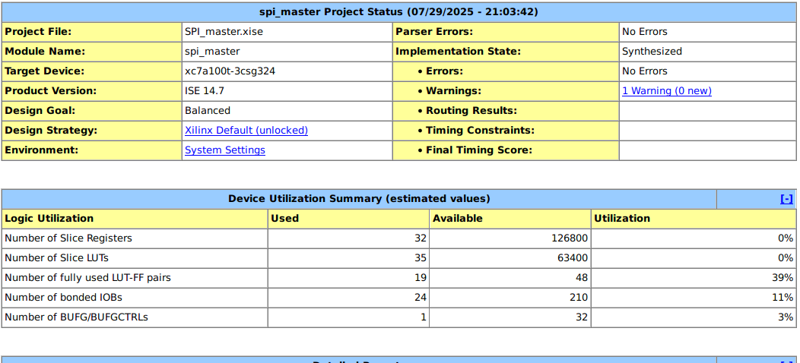

# This a SPI protocol simmulate in Verilog

# 📘 SPI Interface and Verilog Implementation Summary

## 🔹 1. Introduction to SPI

SPI (Serial Peripheral Interface) is a synchronous serial communication protocol used to exchange data between a master device and one or more slave devices. It is widely used for high-speed, short-distance communication in embedded systems.

### Key Characteristics:
- Full-duplex (simultaneous transmit and receive)
- Synchronous (uses clock signal)
- Simple hardware interface
- Typically one master and one or more slaves

---

## 🔹 2. SPI Signals

| Signal | Name                 | Direction         | Description                                 |
|--------|----------------------|-------------------|---------------------------------------------|
| SCLK   | Serial Clock         | Master → Slave    | Clock signal for synchronizing data         |
| MOSI   | Master Out Slave In  | Master → Slave    | Data sent from master to slave              |
| MISO   | Master In Slave Out  | Slave → Master    | Data sent from slave to master              |
| CS     | Chip Select          | Master → Slave    | Active-low signal to select target slave    |

---

## 🔹 3. SPI Modes (Clock Polarity and Phase)

SPI has four modes, based on CPOL (Clock Polarity) and CPHA (Clock Phase):

| Mode | CPOL | CPHA | Description                              |
|------|------|------|------------------------------------------|
| 0    | 0    | 0    | Idle low clock, sample on rising edge    |
| 1    | 0    | 1    | Idle low clock, sample on falling edge   |
| 2    | 1    | 0    | Idle high clock, sample on falling edge  |
| 3    | 1    | 1    | Idle high clock, sample on rising edge   |

> The provided Verilog implementation uses **SPI Mode 0** (CPOL = 0, CPHA = 0)

---

## 🔹 4. SPI Master Module Overview

### Finite State Machine (FSM):
- **IDLE**: Waits for `start` signal.
- **LOAD**: Loads the `data_in` to shift register.
- **TRANSFER**: Shifts out bits over `MOSI`, samples `MISO`, toggles `SCLK`.
- **DONE**: Transfer complete, data is available in `data_out`.

### Key Signals:
- `start`: Pulse to initiate transmission
- `busy`: Indicates transfer in progress
- `data_in`: 8-bit data to send
- `data_out`: 8-bit data received
- `sclk`, `mosi`, `miso`, `cs`: SPI interface lines

---

## 🔹 5. SPI Slave Module Overview

- Listens to the master's `SCLK`, `CS`, and `MOSI`
- Shifts in bits on falling edge of `SCLK`
- Shifts out bits on rising edge of `SCLK`
- Stores received data in `data_rx`
- Loads data to transmit from `data_tx`

---

## 🔹 6. Testbench Overview

The testbench does the following:
1. Initializes master and slave
2. Sets `master_data_in` = `0xA5`, `slave_data_tx` = `0x3C`
3. Starts a transfer using the `start` signal
4. Waits for the `busy` signal to go low
5. Displays received values at both ends

### Expected Output:

> This is the waveform you requested.
Initially, the reset signal is high, so the outputs of both the master and the slave are undefined (X) — 🔴 the red parts on the waveform.
When the reset goes low, the SPI communication process begins.

> This is a spi block look like in xilin ise

> And this is the inside. The RTL-schemetic of it

> This is the report of your code design after synthesis.The table shows the FPGA resource usage after synthesizing the SPI Master–Slave design.

